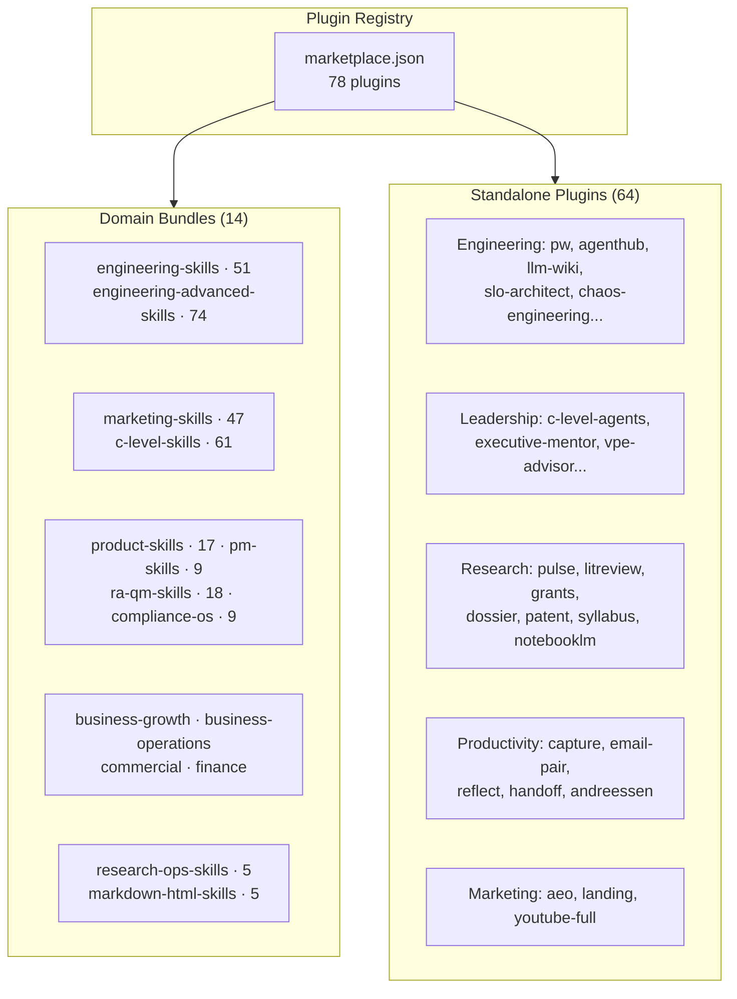

<div class="skills-hero" markdown>

# Плагины и Маркетплейс { #plugins--marketplace }

**78 устанавливаемых плагинов** — 14 доменных пакетов и 64 автономных пакета, распространяемых через реестр плагинов Claude Code и ClawHub.

<p class="skills-hero-sub">Install an entire skill domain or a single tool with one command. Compatible with Claude Code, OpenAI Codex, Gemini CLI, and OpenClaw.</p>

</div>

---

## С первого взгляда { #at-a-glance }

<div class="grid cards" markdown>

-   :material-puzzle-outline:{ .lg .middle } **78 плагинов**

    ---

    14 пакетов доменов + 64 автономных пакета

-   :material-domain:{ .lg .middle } **17 доменов**

    ---

    Инжиниринг, маркетинг, продукт, уровень C, соответствие требованиям, коммерция, операции, исследования, финансы, производительность и многое другое

-   :material-toolbox-outline:{ .lg .middle } **345 Скилл**

    ---

    Каждый скилл из библиотеки можно установить с помощью плагина

-   :material-sync:{ .lg .middle } **4 платформы**

    ---

    Claude Code, OpenAI Codex, Gemini CLI, OpenClaw — единое репозиторий, все платформы

</div>

---

## Быстрая установка { #quick-install }

=== "Код Клода"

    ```bash
    # Add the marketplace
    /plugin marketplace add imgusev/claude-skills-ru

    # Install a domain bundle
    /plugin install engineering-skills@claude-code-skills

    # Or install a standalone plugin
    /plugin install research-orchestrator@claude-code-skills
    ```

=== "Кодекс OpenAI"

    ```bash
    git clone https://github.com/imgusev/claude-skills-ru.git
    cd claude-skills-ru
    ./scripts/codex-install.sh
    ```

=== "Gemini CLI"

    ```bash
    git clone https://github.com/imgusev/claude-skills-ru.git
    cd claude-skills-ru
    python3 scripts/sync-gemini-skills.py --verbose
    ```

=== "OpenClaw"

    ```bash
    curl -sL https://raw.githubusercontent.com/imgusev/claude-skills-ru/main/scripts/openclaw-install.sh | bash
    ```

---

## Архитектура плагина { #plugin-architecture }



---

## Пакеты доменов { #domain-bundles }

Пакеты доменов устанавливают весь домен скилла — все скиллы, инструмент Python, справочные материалы и шаблон в этой папке. Используйте их, когда вам нужен всесторонний охват функциональной области.

| Связка | Скиллы | Что вы получаете | Просматривать |
|---|:-:|---|---|
| `engineering-skills` | 51 | Полная команда инженеров: архитектура, frontend, backend, QA, DevOps, SecOps, AI/ML, data, Драматург Pro, самосовершенствующийся агент | [:octicons-arrow-right-24:](../skills/engineering-team/index.md) |
| `engineering-advanced-skills` | 74 | Дизайнер агентов, архитектор RAG, разработчик MCP-серверов, CI/CD, архитектор SLO, разработка хаоса, аудит безопасности, технический долг | [:octicons-arrow-right-24:](../skills/engineering/index.md) |
| `product-skills` | 17 | PM toolkit (RICE, PRDs), agile PO, UX research, discovery, аналитика, SaaS scaffolder, Apple HIG expert | [:octicons-arrow-right-24:](../skills/product-team/index.md) |
| `marketing-skills` | 47 | Контент, SEO, AEO, CRO, платные каналы, рост, интеллект, стимулирование продаж — 8 специализированных модулей | [:octicons-arrow-right-24:](../skills/marketing-skill/index.md) |
| `c-level-skills` | 61 | Полный набор консультантов, зал заседаний в режиме учредителя, журнал принятия решений, комната для обсуждения сценариев, плейбук слияний и поглощений | [:octicons-arrow-right-24:](../skills/c-level-advisor/index.md) |
| `ra-qm-skills` | 18 | ISO 13485, MDR 2017/745, FDA 510(k)/PMA, ISO 27001, GDPR, CAPA, ISO 14971 управление рисками | [:octicons-arrow-right-24:](../skills/ra-qm-team/index.md) |
| `compliance-os` | 9 | Оркестратор подготовки к аудиту: чек-листы готовности и доказательств для ISO 13485, ISO 27001, SOC 2, GDPR, FDA QSR, EU AI Act, ISO 42001 | [:octicons-arrow-right-24:](../skills/compliance-os/index.md) |
| `pm-skills` | 9 | Старший PM, scrum-мастер, эксперты Jira/Confluence, администратор Atlassian с подключенным удаленным MCP | [:octicons-arrow-right-24:](../skills/project-management/index.md) |
| `business-growth-skills` | 5 | Успех клиентов, организация продаж, операции с доходами, составление контрактов и предложений | [:octicons-arrow-right-24:](../skills/business-growth/index.md) |
| `business-operations-skills` | 7 | Отображение процессов, управление поставщиками, планирование производственных мощностей, внутренняя связь, обмен знаниями, закупки | [:octicons-arrow-right-24:](../skills/business-operations/index.md) |
| `commercial-skills` | 8 | Ценовая стратегия, отдел заключения сделок, партнерские отношения, экономика каналов сбыта, коммерческая политика, реакция на запросы клиентов, прогнозирование | [:octicons-arrow-right-24:](../skills/commercial/index.md) |
| `finance-skills` | 4 | Финансовый аналитик (DCF, коэффициенты, бюджеты), тренер по показателям SaaS, консультант по бизнес-инвестициям | [:octicons-arrow-right-24:](../skills/finance/index.md) |
| `research-ops-skills` | 5 | Разработка клинического исследования, финансирование программы НИОКР, определение размера рынка/опросы, обобщение результатов исследований продукта | [:octicons-arrow-right-24:](../skills/research-ops/index.md) |
| `markdown-html-skills` | 5 | Конвертеры Markdown в HTML: фирменные документы с расширенной формой, ревью кода в две колонки, слайд-панели с возможностью навигации с клавиатуры | [:octicons-arrow-right-24:](../skills/markdown-html/index.md) |

Установите любой пакет с:

```bash
/plugin install <bundle-name>@claude-code-skills
```

---

## Отдельные моменты { #standalone-highlights }

Автономные плагины устанавливают единый скилл или набор инструментов. Используйте их, когда вам нужна одна конкретная возможность без полного пакета домена.

### Исследование (8 плагинов) { #research-8-plugins }

| Плагин | Что он делает |
|---|---|
| `research-orchestrator` | ** Гибридный маршрутизатор + резервный вариант ** — классифицирует ваш вопрос и направляет к специалисту или запускает собственный 8-шаговый исследовательский воркфлоу |
| `pulse` | Исследование последних событий из нескольких источников (Reddit / HN / X / web) с учетом настроений |
| `litreview` | Ревью академической литературы с использованием фреймворков PICO/SPIDER |
| `grants` | Информация о грантовом финансировании NIH |
| `dossier` | Исследование объектов на уровне принятия решений |
| `patent` | Патентный уровень техники и ландшафт интеллектуальной собственности |
| `syllabus` | Списки дополнительного чтения курса (прилагаемый генератор DOCX) |
| `notebooklm` | Автоматизация браузера Google NotebookLM |

### Производительность (5 плагинов) { #productivity-5-plugins }

| Плагин | Что он делает |
|---|---|
| `capture-skill` | Рабочее пространство "От свалки мозгов к действию" |
| `email-pair` | Сопряженный почтовый ящик-настройка + сортировка входящих сообщений с контрактом на базу знаний из 7 файлов |
| `reflect-skill` | Журнал отражения света-промпт |
| `handoff-productivity` | Заметки о сеансе-хэндофф с возможностью редактирования и автоматической загрузки |
| `andreessen` | Первое на рынке решение - тестирование под давлением в режиме Марка Андреессена |

### Инженерные фавориты { #engineering-favorites }

`pw` (Профессиональный драматург), `self-improving-agent`, `agenthub`, `autoresearch-agent`, `llm-wiki`, `slo-architect`, `chaos-engineering`, `kubernetes-operator`, `feature-flags-architect`, `karpathy-coder`, `write-a-skill`, `security-guidance`, `universal-scraping-architect` — просмотрите их все в [Инженерно — продвинутый](../skills/engineering/index.md).

---

## Структура плагина { #plugin-structure }

Каждый плагин следует одной и той же минимальной схеме для максимальной переносимости:

```json
{
  "name": "plugin-name",
  "description": "What it does",
  "version": "2.10.0",
  "author": { "name": "Author Name" },
  "homepage": "https://...",
  "repository": "https://...",
  "license": "MIT",
  "skills": ["./skills/<name>"]
}
```

Разрешены два утвержденных поля добавочного номера:

- **`source`** (объект) — метаданные о происхождении скилл, полученных с помощью мегапроекта Path-B (производительность, маркетинг, исследования).
- **`attribution`** (объект) — кредитные метаданные для внешних производных, лицензированных MIT (`caveman`, `grill-me`, `grill-with-docs`).

!!! info "ClawHub Registry"
    Плагины распространяются через [Когтистый удар](https://clawhub.com) как публичный реестр. Тот `cs-` префикс используется только в том случае, если slug уже взят другим издателем — имена папок репозитория остаются неизменными.

---

## Матрица совместимости { #compatibility-matrix }

| Платформа | Установка пакета | Автономная установка | Слэш-команды | Агенты |
|----------|:-:|:-:|:-:|:-:|
| **Код Клода** | :material-check: | :material-check: | :material-check: | :material-check: |
| **Кодекс OpenAI** | :material-check: | :material-check: | :material-close: | :material-close: |
| **Интерфейс Gemini CLI** | :material-check: | :material-check: | :material-close: | :material-close: |
| **Открытый язык** | :material-check: | :material-check: | :material-close: | :material-close: |

!!! tip "Full feature support"
    Слэш-команды (например `/cs:research`, `/pw:generate`) и появление агента (например `cs-research`) являются функциями кода Claude. На других платформах работают базовые скиллы и инструменты Python — просто без оболочек команд/агентов.

---

## Все 78 плагинов с первого взгляда { #all-78-plugins-at-a-glance }

| Плагин | Тип | Категория | Источник |
|---|---|---|---|
| `business-growth-skills` | Связка | рост бизнеса | `./business-growth` |
| `commercial-skills` | Связка | коммерческий | `./commercial` |
| `compliance-os` | Связка | соответствие требованиям | `./compliance-os` |
| `ra-qm-skills` | Связка | соответствие требованиям | `./ra-qm-team` |
| `engineering-advanced-skills` | Связка | развитие | `./engineering` |
| `engineering-skills` | Связка | развитие | `./engineering-team` |
| `markdown-html-skills` | Связка | документация | `./markdown-html` |
| `finance-skills` | Связка | финансы | `./finance` |
| `c-level-skills` | Связка | лидерство | `./c-level-advisor` |
| `marketing-skills` | Связка | маркетинг | `./marketing-skill` |
| `business-operations-skills` | Связка | операции | `./business-operations` |
| `product-skills` | Связка | продукт | `./product-team` |
| `pm-skills` | Связка | управление проектами | `./project-management` |
| `research-ops-skills` | Связка | исследовательские операции | `./research-ops` |
| `compliance-team-eu-ai-act` | Автономный | соответствие требованиям | `./ra-qm-team/compliance-team-eu-ai-act` |
| `compliance-team-iso42001` | Автономный | соответствие требованиям | `./ra-qm-team/compliance-team-iso42001` |
| `apple-hig-expert` | Автономный | дизайн | `./product-team/apple-hig-expert` |
| `a11y-audit` | Автономный | развитие | `./engineering-team/a11y-audit` |
| `agenthub` | Автономный | развитие | `./engineering/agenthub` |
| `autoresearch-agent` | Автономный | развитие | `./engineering/autoresearch-agent` |
| `behuman` | Автономный | развитие | `./engineering/behuman` |
| `caveman` | Автономный | развитие | `./engineering/caveman` |
| `chaos-engineering` | Автономный | развитие | `./engineering/chaos-engineering` |
| `claude-coach` | Автономный | развитие | `./engineering/claude-coach` |
| `code-tour` | Автономный | развитие | `./engineering/code-tour` |
| `data-quality-auditor` | Автономный | развитие | `./engineering/data-quality-auditor` |
| `demo-video` | Автономный | развитие | `./engineering/demo-video` |
| `docker-development` | Автономный | развитие | `./engineering/docker-development` |
| `feature-flags-architect` | Автономный | развитие | `./engineering/feature-flags-architect` |
| `google-workspace-cli` | Автономный | развитие | `./engineering-team/google-workspace-cli` |
| `grill-me` | Автономный | развитие | `./engineering/grill-me` |
| `grill-with-docs` | Автономный | развитие | `./engineering/grill-with-docs` |
| `handoff-engineering` | Автономный | развитие | `./engineering/handoff` |
| `helm-chart-builder` | Автономный | развитие | `./engineering/helm-chart-builder` |
| `karpathy-coder` | Автономный | развитие | `./engineering/karpathy-coder` |
| `kubernetes-operator` | Автономный | развитие | `./engineering/kubernetes-operator` |
| `llm-cost-optimizer` | Автономный | развитие | `./engineering/llm-cost-optimizer` |
| `prompt-governance` | Автономный | развитие | `./engineering/prompt-governance` |
| `pw` | Автономный | развитие | `./engineering-team/playwright-pro` |
| `security-guidance` | Автономный | развитие | `./engineering/security-guidance` |
| `self-improving-agent` | Автономный | развитие | `./engineering-team/self-improving-agent` |
| `slo-architect` | Автономный | развитие | `./engineering/slo-architect` |
| `snowflake-development` | Автономный | развитие | `./engineering-team/snowflake-development` |
| `statistical-analyst` | Автономный | развитие | `./engineering/statistical-analyst` |
| `terraform-patterns` | Автономный | развитие | `./engineering/terraform-patterns` |
| `universal-scraping-architect` | Автономный | развитие | `./engineering/universal-scraping-architect` |
| `workflow-builder` | Автономный | развитие | `./engineering/workflow-builder` |
| `write-a-skill` | Автономный | развитие | `./engineering/write-a-skill` |
| `collab-proof` | Автономный | инженерное дело | `./engineering/collab-proof` |
| `business-investment-advisor` | Автономный | финансы | `./finance/business-investment-advisor` |
| `llm-wiki` | Автономный | знание | `./engineering/llm-wiki` |
| `c-level-agents` | Автономный | лидерство | `./c-level-advisor/c-level-agents` |
| `chief-ai-officer-advisor` | Автономный | лидерство | `./c-level-advisor/chief-ai-officer-advisor` |
| `chief-customer-officer-advisor` | Автономный | лидерство | `./c-level-advisor/chief-customer-officer-advisor` |
| `chief-data-officer-advisor` | Автономный | лидерство | `./c-level-advisor/chief-data-officer-advisor` |
| `executive-mentor` | Автономный | лидерство | `./c-level-advisor/executive-mentor` |
| `general-counsel-advisor` | Автономный | лидерство | `./c-level-advisor/general-counsel-advisor` |
| `vpe-advisor` | Автономный | лидерство | `./c-level-advisor/vpe-advisor` |
| `aeo` | Автономный | маркетинг | `./marketing-skill/skills/aeo` |
| `landing` | Автономный | маркетинг | `./marketing/landing` |
| `video-content-strategist` | Автономный | маркетинг | `./marketing-skill/video-content-strategist` |
| `youtube-full` | Автономный | маркетинг | `./marketing-skill/skills/youtube-full` |
| `agile-product-owner` | Автономный | продукт | `./product-team/agile-product-owner` |
| `code-to-prd` | Автономный | продукт | `./product-team/code-to-prd` |
| `research-summarizer` | Автономный | продукт | `./product-team/research-summarizer` |
| `andreessen` | Автономный | производительность | `./productivity/andreessen` |
| `capture-skill` | Автономный | производительность | `./productivity/capture` |
| `email-pair` | Автономный | производительность | `./productivity/email` |
| `handoff-productivity` | Автономный | производительность | `./productivity/handoff` |
| `reflect-skill` | Автономный | производительность | `./productivity/reflect` |
| `dossier` | Автономный | исследование | `./research/dossier` |
| `grants` | Автономный | исследование | `./research/grants` |
| `litreview` | Автономный | исследование | `./research/litreview` |
| `notebooklm` | Автономный | исследование | `./research/notebooklm` |
| `patent` | Автономный | исследование | `./research/patent` |
| `pulse` | Автономный | исследование | `./research/pulse` |
| `research-orchestrator` | Автономный | исследование | `./research/research` |
| `syllabus` | Автономный | исследование | `./research/syllabus` |

---

## Часто задаваемые вопросы { #faq }

??? question "What's the difference between a bundle and a standalone plugin?"
    **Пакеты ** устанавливают все скиллы в домене (например, `marketing-skills` устанавливает все 48 маркетинговых скиллы). ** Автономные ** плагины устанавливают один скилл или набор инструментов (например, `pulse` устанавливает только скилл для исследования последних событий). Автономные плагины являются подмножествами их родительского пакета, когда это применимо — установка обоих безопасна, но избыточна.

??? question "What is the research orchestrator?"
    `research-orchestrator` это ** гибридный маршрутизатор + резервный вариант **, который детерминированно классифицирует любой исследовательский вопрос и либо делегирует его одному из шести специалистов (pulse, litreview, grants, dossier, patent, syllabus, notebooklm) с достоверностью ≥2 сигналов, либо запускает свой собственный 8-шаговый план - декомпозиция-поиск-синтез.-ссылайтесь на воркфлоу, если ни один специалист не подходит. Прозрачность маршрутизации обязательна — она никогда не делегируется автоматически.

??? question "Can I install multiple plugins?"
    Да. Плагины предназначены для сосуществования без конфликтов. Каждый скилл самодостаточен и не имеет перекрестных зависимостей.

??? question "Do plugins require API keys or paid services?"
    Нет. Все инструменты Python используют только стандартную библиотеку. Некоторые скиллы ссылаются на внешние сервисы (AWS, Google Workspace, Stripe, NIH RePORTER, Reddit /HN API), но следуют шаблону BYOK (принесите свой собственный ключ) - вы используете свои собственные учетные записи.

??? question "How do I update plugins?"
    Повторно запустите команду установки. Плагины следуют семантическому управлению версиями, согласованному с выпусками репозитория.

??? question "What is ClawHub?"
    [Когтистый удар](https://clawhub.com) это публичный реестр плагинов Claude Code — думайте об этом как о npm для скиллы агента искусственного интеллекта. Тот `cs-` префикс используется только в том случае, если модуль плагина конфликтует с другим издателем.

??? question "Can I use skills without installing anything?"
    Да. Есть [6 Пользовательских GPTS для ChatGPT](../custom-gpts.md) это превращает скиллы агента в диалоговый интерфейс — без установки, без ключей API. Просто нажмите и общайтесь в чате.
