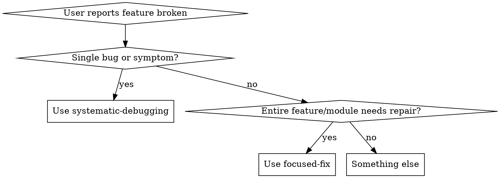
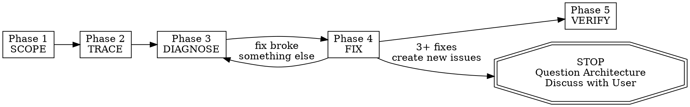

# Целенаправленное исправление — Восстановление функции глубокого погружения { #focused-fix--deep-dive-feature-repair }

<div class="page-meta" markdown>
<span class="meta-badge">:material-rocket-launch: Инженерия — уровень POWERFUL</span>
<span class="meta-badge">:material-identifier: `focused-fix`</span>
<span class="meta-badge">:material-github: <a href="https://github.com/imgusev/claude-skills-ru/tree/main/engineering/skills/focused-fix/SKILL.md">Источник</a></span>
</div>

<div class="install-banner" markdown>
<span class="install-label">Установить:</span> <code>claude /plugin install engineering-advanced-skills</code>
</div>


## Когда использовать { #when-to-use }

Активируется, когда пользователь просит исправить, отладить или заставить работать определенную функцию/модуль/область. Ключевые триггеры:
- "заставь X работать"
- "исправьте функцию Y"
- "модуль Z сломан"
- "сосредоточься на [площадь]"
- "эта функция должна работать должным образом"

Это не для быстрого исправления отдельных ошибок (для этого используйте систематическую отладку). Это для случаев, когда вся функция или модуль нуждается в систематическом ремонте — отслеживании каждой зависимости, чтении журналов, проверке тестов, отображении полного графика зависимостей.



## Железный закон { #the-iron-law }

```
NO FIXES WITHOUT COMPLETING SCOPE → TRACE → DIAGNOSE FIRST
```

Если вы не завершили этап 3, вы не можете предлагать исправления. Точка.

**Нарушение буквы этих этапов противоречит духу целенаправленного ремонта.**

## Протокол — СТРОГО следуйте этим 5 этапам ПО ПОРЯДКУ { #protocol--strictly-follow-these-5-phases-in-order }



### Этап 1: ОБЛАСТЬ применения — Нанесение на карту границы объекта { #phase-1-scope--map-the-feature-boundary }

Прежде чем прикасаться к какому-либо коду, ознакомьтесь с полным объемом этой функции.

1. Спросите пользователя: "На какой функции / папке мне следует сосредоточиться?", если это еще не ясно
2. Определите основную папку/файлы для этой функции
3. Сопоставьте КАЖДЫЙ файл в этой папке — прочитайте каждый из них, поймите его назначение
4. Создайте манифест объекта:

```
FEATURE SCOPE:
  Primary path: src/features/auth/
  Entry points: [files that are imported by other parts of the app]
  Internal files: [files only used within this feature]
  Total files: N
  Total lines: N
```

### Фаза 2: ТРАССИРОВКА — Сопоставление всех зависимостей (внутренних И внешних) { #phase-2-trace--map-all-dependencies-inside-and-outside }

Проследите каждое соединение, которое имеет эта функция с остальной частью кодовой базы.

**ВХОДЯЩИЙ (то, что импортирует эта функция):**
1. Для каждой инструкции импорта в каждом файле в папке компонентов:
   - Проследите его до источника
   - Убедитесь, что исходный файл существует
   - Убедитесь, что импортированный объект (функция, тип, компонент) существует и экспортирован
   - Проверьте, соответствуют ли типы/сигнатуры ожиданиям функции
2. Проверьте наличие:
   - Используемые переменные окружения (grep для process.env, import.meta.env, os.environ и т.д.)
   - Ссылки на конфигурационные файлы
   - Используемые модели/схемы баз данных
   - Вызываемые конечные точки API
   - Импортированные пакеты сторонних производителей

**ИСХОДЯЩИЙ (что импортирует эту функцию):**
1. Выполните поиск по всей базе кода для импорта из этой папки компонентов
2. Для каждого потребителя:
   - Убедитесь, что они импортируют объекты, которые действительно существуют
   - Проверьте, используют ли они правильный API / интерфейс
   - Обратите внимание, используют ли какие-либо потребители устаревшие шаблоны

Выходной формат:
```
DEPENDENCY MAP:
  Inbound (this feature depends on):
    src/lib/db.ts → used in auth/repository.ts (getUserById, createUser)
    src/lib/jwt.ts → used in auth/service.ts (signToken, verifyToken)
    @prisma/client → used in auth/repository.ts
    process.env.JWT_SECRET → used in auth/service.ts
    process.env.DATABASE_URL → used via prisma

  Outbound (depends on this feature):
    src/app/api/login/route.ts → imports { login } from auth/service
    src/app/api/register/route.ts → imports { register } from auth/service
    src/middleware.ts → imports { verifyToken } from auth/service

  Env vars required: JWT_SECRET, DATABASE_URL
  Config files: prisma/schema.prisma (User model)
```

### Этап 3: ДИАГНОСТИКА — Поиск каждой проблемы { #phase-3-diagnose--find-every-issue }

Систематически проверяйте наличие проблем. Выполните все эти проверки:

**КАЧЕСТВО КОДА:**
- [ ] Каждый импорт преобразуется в реальный файл/экспорт
- [ ] Нет циклических зависимостей внутри функции
- [ ] Типы согласованы между собой через границы (нет `any` на интерфейсах)
- [ ] Обработка ошибок существует для всех асинхронных операций
- [ ] Нет комментариев TODO /FIXME /HACK, указывающих на известные проблемы

**ВРЕМЯ ВЫПОЛНЕНИЯ:**
- [ ] Установлены все необходимые переменные окружения (проверьте .env)
- [ ] Миграции баз данных обновлены (если применимо)
- [ ] Конечные точки API возвращают ожидаемые формы
- [ ] Нет жестко заданных значений, которые должны быть настраиваемыми

**ТЕСТЫ:**
- [ ] Запустите ВСЕ тесты, связанные с этой функцией: найдите их, выполнив поиск импорта из папки функций
- [ ] Записывайте каждый сбой с полным выводом ошибок
- [ ] Проверьте тестовое покрытие — есть ли непроверенные пути к коду?

**ЖУРНАЛЫ и ОШИБКИ:**
- [ ] Поиск любых файлов журналов, отчетов об ошибках или отслеживание ошибок в стиле Sentry
- [ ] Проверьте git log на наличие последних изменений в этой функции: `git log --oneline -20 -- <feature-path>`
- [ ] Проверьте, не могли ли какие-либо недавние фиксации что-то нарушить: `git log --oneline -5 --all -- <files that this feature depends on>`

**КОНФИГУРАЦИЯ:**
- [ ] Убедитесь, что все конфигурационные файлы, от которых зависит эта функция, действительны
- [ ] Проверьте на наличие несоответствий между конфигурациями разработки и производства
- [ ] Убедитесь, что учетные данные сторонней службы действительны (если их можно проверить).

**ПОДТВЕРЖДЕНИЕ ПЕРВОПРИЧИНЫ:**
Для каждой обнаруженной критической проблемы подтвердите первопричину, прежде чем добавлять ее в список исправлений:
- Четко сформулируйте: "Я думаю, что X является первопричиной, потому что Y".
- Проследите поток данных/управления в обратном направлении, чтобы убедиться — не доверяйте симптомам поверхностного уровня
- Если проблема затрагивает несколько компонентов, добавьте ведение журнала диагностики на каждой границе, чтобы определить, на каком уровне произошел сбой
- **ТРЕБУЕМЫЙ ДОПОЛНИТЕЛЬНЫЙ СКИЛЛ:** Для сложных ошибок, обнаруженных во время диагностики, применяйте `superpowers:systematic-debugging` Фаза 1 (Расследование первопричины) для подтверждения перед продолжением

**МАРКИРОВКА РИСКОВ:**
Присвоите каждой проблеме маркировку риска:

| Риск | Критерии |
|---|---|
| ВЫСОКИЙ | Поверхность публичного API / контракт на разрыв интерфейса / схема базы данных / логика аутентификации или безопасности / широко импортируемый модуль (>3 вызывающих абонента) / точка доступа git |
| МЕД | Внутренний модуль с тестами / общая утилита / конфигурация с влиянием во время выполнения / внутренние вызывающие устройства измененных функций |
| НИЗКИЙ | Конечный модуль / изолированный файл / изменение только для тестирования / универсальный помощник без вызывающих устройств |

Выходной формат:
```
DIAGNOSIS REPORT:
  Issues found: N

  CRITICAL:
    1. [HIGH] [file:line] — description of issue. Root cause: [confirmed explanation]
    2. [HIGH] [file:line] — description of issue. Root cause: [confirmed explanation]

  WARNINGS:
    1. [MED] [file:line] — description of issue
    2. [LOW] [file:line] — description of issue

  TESTS:
    Ran: N tests
    Passed: N
    Failed: N
    [list each failure with one-line summary]
```

### Фаза 4: ИСПРАВЛЕНИЕ — Систематически восстанавливайте все { #phase-4-fix--repair-everything-systematically }

Устраняйте проблемы именно в этом порядке:

1. ** СНАЧАЛА ЗАВИСИМОСТИ ** — исправьте нарушенный импорт, отсутствующие пакеты, неправильные версии
2. **ТИПЫ ВТОРЫЕ** — исправлены несоответствия типов на границах объектов
3. ** ЛОГИКА ТРЕТЬЯ ** — исправлены фактические ошибки бизнес-логики
4. **ТЕСТЫ ЧЕТВЕРТЫЕ** — исправьте или создайте тесты для каждого исправления
5. ** ПОСЛЕДНЯЯ ИНТЕГРАЦИЯ ** — убедитесь, что функция работает комплексно со своими потребителями

Правила:
- Устраняйте по одной проблеме за раз
- После каждого исправления запускайте соответствующий тест, чтобы подтвердить, что он работает
- Если исправление нарушает что-то еще, ОСТАНОВИТЕСЬ и повторите оценку (вернитесь к ДИАГНОСТИКЕ).
- Ведите текущий журнал всех внесенных изменений
- Никогда не меняйте код за пределами папки компонентов без явного указания причины
- Устраняйте проблемы высокого риска до MED, СРЕДНЕГО до НИЗКОГО

**ПРАВИЛО ЭСКАЛАЦИИ — Проверка архитектуры 3-го удара:**
Если более 3 исправлений на этом этапе создадут новые проблемы (а не ранее существовавшие), немедленно прекратите.

Этот шаблон указывает на архитектурную проблему, а не на набор ошибок:
- Каждое исправление выявляет новое общее состояние / связь / проблему в другом месте
- Исправления требуют "масштабного рефакторинга" для реализации
- Каждое исправление создает новые симптомы в другом месте

**Действие:** Прекратите фиксацию. Сообщите пользователю: "Более 3 исправлений привели к появлению новых проблем. Это говорит о том, что архитектура функции, возможно, нуждается в переосмыслении, а не в исправлении. Вот что я нашел: [краткое содержание]. Должны ли мы продолжать устранять симптомы или обсудить реструктуризацию?"

НЕ пытайтесь исправить # 4 без этого обсуждения.

Вывод после каждого исправления:
```
FIX #1:
  File: auth/service.ts:45
  Issue: signToken called with wrong argument order
  Change: swapped (expiresIn, payload) to (payload, expiresIn)
  Test: auth.test.ts → PASSES
```

### Этап 5: ПРОВЕРКА — Подтвердите, что все работает { #phase-5-verify--confirm-everything-works }

После применения всех исправлений:

1. Запустите ВСЕ тесты в папке с функциями — каждый из них должен пройти
2. Запустите ВСЕ тесты в файлах, которые импортируются из этой функции — должны пройти
3. Запустите полный набор тестов, если он доступен — проверьте наличие регрессий
4. Если у функции есть пользовательский интерфейс, опишите, как проверить его вручную
5. Обобщите все внесенные изменения

Конечный результат:
```
FOCUSED FIX COMPLETE:
  Feature: auth
  Files changed: 4
  Total fixes: 7
  Tests: 23/23 passing
  Regressions: 0

  Changes:
    1. auth/service.ts — fixed token signing argument order
    2. auth/repository.ts — added null check for user lookup
    3. auth/middleware.ts — fixed async error handling
    4. auth/types.ts — aligned UserResponse type with actual DB schema

  Consumers verified:
    - src/app/api/login/route.ts ✅
    - src/app/api/register/route.ts ✅
    - src/middleware.ts ✅
```

## Красные флажки — ОСТАНОВКА и возврат к текущей фазе { #red-flags--stop-and-return-to-current-phase }

Если вы поймаете себя на мысли о чем-либо из этого, вы пропускаете этапы:

- "Я вижу ошибку, позвольте мне просто исправить ее" → СТОП. Вы еще не отследили зависимости.
- "Определение области действия - это перебор, очевидно, что это только этот файл" → СТОП. Это всегда неправильно для исправлений на уровне функций.
- "Я сопоставлю зависимости после того, как исправлю очевидные вещи" → СТОП. Вы упустите первопричины.
- "Пользователь сказал исправить X, поэтому мне нужно только посмотреть на X" → ОСТАНОВИТЬ. Функции имеют зависимости.
- "Тесты проходят, так что я закончил" → СТОП. Вы тоже проводили потребительские тесты?
- "Мне не нужно проверять env vars для этого" → СТОП. Проблемы с конфигурацией маскируются под ошибки кода.
- "Еще одно исправление должно сделать это" (после 2+ каскадных сбоев) → ОСТАНОВИТЬ. Эскалация.
- "Я пропущу отчет о диагностике, исправления очевидны" → СТОП. Запишите это.

** ВСЕ это означает: вернитесь в ту фазу, в которой вы должны находиться.**

## Распространенные объяснения { #common-rationalizations }

| Оправдание | Реальность |
|---|---|
| "Функция небольшая, мне не нужны все 5 этапов" | Небольшие функции тоже имеют зависимости. Этапы 1-2 занимают несколько минут для выполнения небольших функций — выполняйте их. |
| "Я уже знаю эту кодовую базу" | Знание разлагается. Отслеживайте фактический импорт, не полагайтесь на память. |
| "Пользователь хочет скорости, а не процесса" | Пропуск этапов приводит к переделке. Систематичность - это быстрее, чем избиение. |
| "Поврежден только один файл" | Если бы был поврежден только один файл, пользователь сказал бы "исправьте эту ошибку", а не "заставьте функцию работать". |
| "Я исправил тесты, так что это работает" | Тесты могут проходить, пока потребители не работают. Полностью проверьте этап 5. |
| "Карта зависимостей слишком велика, чтобы ее можно было отследить" | Тогда функция слишком велика, чтобы ее можно было исправить без трассировки. Именно поэтому вам это и нужно. |
| "Первопричина очевидна, мне не нужно подтверждать" | "Очевидные" первопричины в 40% случаев ошибочны. Подтвердите это доказательствами. |
| "3 каскадных сбоя - это нормально для крупного исправления" | 3 каскадные сбои означают, что вы исправляете симптомы архитектурной проблемы. |

## Анти-паттерны — НИКОГДА не делайте этого { #anti-patterns--never-do-these }

| Анти-паттерн | Почему это неправильно |
|---|---|
| Начинаем исправлять код перед сопоставлением всех зависимостей | Вы упустите первопричины и создадите простые исправления |
| Исправление только того файла, который упомянул пользователь | Связанные файлы, вероятно, тоже имеют проблемы |
| Игнорирование переменных окружения и конфигурации | Многие "ошибки кода" на самом деле являются проблемами конфигурации |
| Пропуск этапа тестового запуска | Вы не можете проверить исправления без запуска тестов |
| Внесение изменений за пределами папки компонентов без объяснения причин | Неожиданные побочные эффекты сбивают пользователя с толку |
| Исправление симптомов в файлах-потребителях вместо основной причины в функции | Пластыри, которые ломаются при появлении следующего потребителя |
| Объявление "готово" без запуска проверочных тестов | Непроверенные исправления - это непроверенные исправления |
| Изменение общедоступного API без обновления всех потребителей | Ломает все, что зависит от функции |

## Связанные скиллы { #related-skills }

- **`superpowers:systematic-debugging`** — Используется в рамках фазы 3 для отслеживания первопричин отдельных сложных ошибок
- **`superpowers:verification-before-completion`** — Используйте в рамках фазы 5, прежде чем заявлять, что функция исправлена
- **`scope`** — Если вам нужно определить радиус поражения перед запуском, сначала запустите scope, а затем focused-исправьте

## Краткий справочник { #quick-reference }

| Фаза | Ключевое действие | Выход |
|---|---|---|
| СФЕРА ПРИМЕНЕНИЯ | Прочитайте каждый файл, составьте карту точек входа | Манифест функции |
| ПРОСЛЕДИТЬ | Сопоставьте входящие и исходящие зависимости | Карта зависимостей |
| ДИАГНОСТИРОВАТЬ | Проверьте код, время выполнения, тесты, журналы, конфигурацию | Отчет о диагностике |
| ИСПРАВИТЬ | Исправлять по порядку: deps → типы → логика → тесты → интеграция | Исправление журнала для каждой проблемы |
| ПРОВЕРИТЬ | Запустите все тесты, проверьте потребителей, подведите итоги | Отчет о завершении работы |
