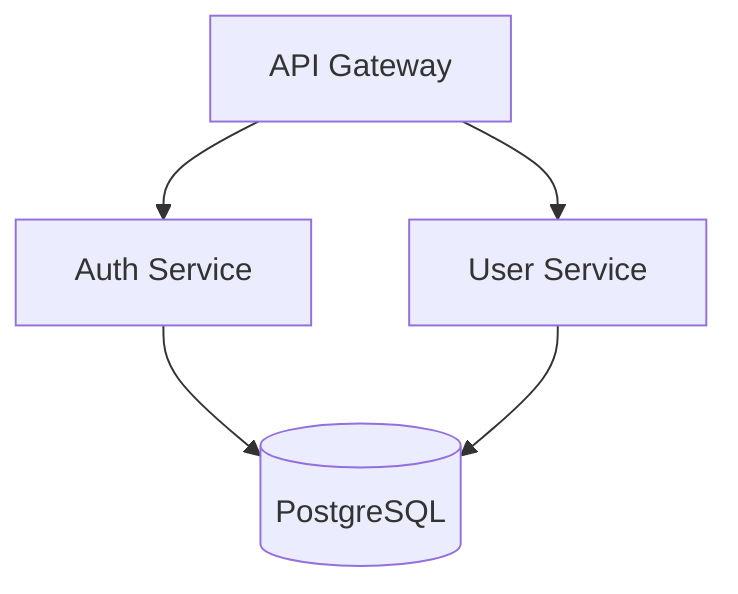

# Старший архитектор { #senior-architect }

Инструменты проектирования архитектуры и анализа для принятия обоснованных технических решений.

## Оглавление { #table-of-contents }

- [Быстрый старт](#quick-start)
- [Обзор инструментов](#tools-overview)
  - [Генератор архитектурных схем](#1-architecture-diagram-generator)
  - [Анализатор зависимостей](#2-dependency-analyzer)
  - [Архитектор проекта](#3-project-architect)
- [Воркфлоу принятия решений](#decision-workflows)
  - [Выбор базы данных](#database-selection-workflow)
  - [Выбор архитектурного шаблона](#architecture-pattern-selection-workflow)
  - [Монолит против микросервисов](#monolith-vs-microservices-decision)
- [Справочная документация](#reference-documentation)
- [Охват технологического стека](#tech-stack-coverage)
- [Общие команды](#common-commands)

---

## Быстрый старт { #quick-start }

```bash
# Generate architecture diagram from project
python scripts/architecture_diagram_generator.py ./my-project --format mermaid

# Analyze dependencies for issues
python scripts/dependency_analyzer.py ./my-project --output json

# Get architecture assessment
python scripts/project_architect.py ./my-project --verbose
```

---

## Обзор инструментов { #tools-overview }

### 1. Генератор архитектурных схем { #1-architecture-diagram-generator }

Генерирует архитектурные диаграммы из структуры проекта в нескольких форматах.

** Решает: ** "Мне нужно визуализировать архитектуру моей системы для документации или командного обсуждения"

**Ввод:** Путь к каталогу проекта
**Выходные данные:** Код диаграммы (Mermaid, PlantUML или ASCII)

**Поддерживаемые типы диаграмм:**
- `component` - Показывает модули и их взаимосвязи
- `layer` - Показывает архитектурные слои (презентация, бизнес, данные)
- `deployment` - Показывает топологию развертывания

**Использование:**
```bash
# Mermaid format (default)
python scripts/architecture_diagram_generator.py ./project --format mermaid --type component

# PlantUML format
python scripts/architecture_diagram_generator.py ./project --format plantuml --type layer

# ASCII format (terminal-friendly)
python scripts/architecture_diagram_generator.py ./project --format ascii

# Save to file
python scripts/architecture_diagram_generator.py ./project -o architecture.md
```

**Пример вывода (Русалка):**


---

### 2. Анализатор зависимостей { #2-dependency-analyzer }

Анализирует зависимости проекта на предмет связывания, циклических зависимостей и устаревших пакетов.

** Решает: ** "Мне нужно понять свое дерево зависимостей и выявить потенциальные проблемы"

**Ввод:** Путь к каталогу проекта
** Выходные данные:** Отчет об анализе (JSON или удобочитаемый)

**Анализирует:**
- Дерево зависимостей (прямое и транзитивное)
- Циклические зависимости между модулями
- Оценка сцепления (0-100)
- Устаревшие пакеты

**Поддерживаемые менеджеры пакетов:**
- npm/пряжа (`package.json`)
- Питон (`requirements.txt`, `pyproject.toml`)
- Иди (`go.mod`)
- Ржавчина (`Cargo.toml`)

**Использование:**
```bash
# Human-readable report
python scripts/dependency_analyzer.py ./project

# JSON output for CI/CD integration
python scripts/dependency_analyzer.py ./project --output json

# Check only for circular dependencies
python scripts/dependency_analyzer.py ./project --check circular

# Verbose mode with recommendations
python scripts/dependency_analyzer.py ./project --verbose
```

**Пример вывода:**
```
Dependency Analysis Report
==========================
Total dependencies: 47 (32 direct, 15 transitive)
Coupling score: 72/100 (moderate)

Issues found:
- CIRCULAR: auth → user → permissions → auth
- OUTDATED: lodash 4.17.15 → 4.17.21 (security)

Recommendations:
1. Extract shared interface to break circular dependency
2. Update lodash to fix CVE-2020-8203
```

---

### 3. Архитектор проекта { #3-project-architect }

Анализирует структуру проекта и обнаруживает архитектурные шаблоны, запахи кода и возможности для улучшения.

** Решает:** "Я хочу понять текущую архитектуру и определить области для улучшения"

**Ввод:** Путь к каталогу проекта
**Результат:** Отчет об оценке архитектуры

**Обнаруживает:**
- Архитектурные шаблоны (MVC, многоуровневые, шестиугольные индикаторы, микросервисы)
- Проблемы с организацией кода (классы god, смешанные проблемы)
- Нарушения слоев
- Недостающие архитектурные компоненты

**Использование:**
```bash
# Full assessment
python scripts/project_architect.py ./project

# Verbose with detailed recommendations
python scripts/project_architect.py ./project --verbose

# JSON output
python scripts/project_architect.py ./project --output json

# Check specific aspect
python scripts/project_architect.py ./project --check layers
```

**Пример вывода:**
```
Architecture Assessment
=======================
Detected pattern: Layered Architecture (confidence: 85%)

Structure analysis:
  ✓ controllers/  - Presentation layer detected
  ✓ services/     - Business logic layer detected
  ✓ repositories/ - Data access layer detected
  ⚠ models/       - Mixed domain and DTOs

Issues:
- LARGE FILE: UserService.ts (1,847 lines) - consider splitting
- MIXED CONCERNS: PaymentController contains business logic

Recommendations:
1. Split UserService into focused services
2. Move business logic from controllers to services
3. Separate domain models from DTOs
```

---

## Воркфлоу принятия решений { #decision-workflows }

### Воркфлоу выбора базы данных { #database-selection-workflow }

Используйте при выборе базы данных для нового проекта или переносе существующих данных.

**Шаг 1: Определите характеристики данных**
| Характеристика | Указывает на SQL | Указывает на NoSQL |
|----------------|---------------|-----------------|
| Структурированный с помощью связей | ✓ | |
| Требуемые транзакции ACID | ✓ | |
| Гибкая/эволюционирующая схема | | ✓ |
| Данные, ориентированные на документ | | ✓ |
| Данные временных рядов | | ✓ (специализированный) |

**Шаг 2: Оцените требования к шкале**
- <1 млн записей, один регион → PostgreSQL или MySQL
- 1 МЛН-100 млн записей, с большим объемом чтения → PostgreSQL с репликами чтения
- >100 миллионов записей, глобальное распространение → CockroachDB, Spanner или DynamoDB
- Высокая пропускная способность записи (>10 Кбит/сек) → Cassandra или ScyllaDB

**Шаг 3: Проверьте требования к согласованности**
- Требуется строгая согласованность → SQL или CockroachDB
- Конечная приемлемая согласованность → DynamoDB, Cassandra, MongoDB

**Шаг 4: Документальное решение**
Создайте ADR (запись архитектурного решения) с помощью:
- Контекст и требования
- Рассмотренные варианты
- Решение и обоснование
- Принятые компромиссы

**Краткий справочник:**
```
PostgreSQL → Default choice for most applications
MongoDB    → Document store, flexible schema
Redis      → Caching, sessions, real-time features
DynamoDB   → Serverless, auto-scaling, AWS-native
TimescaleDB → Time-series data with SQL interface
```

---

### Воркфлоу выбора архитектурного шаблона { #architecture-pattern-selection-workflow }

Используйте при проектировании новой системы или рефакторинге существующей архитектуры.

**Шаг 1: Оцените команду и размер проекта**
| Размер команды | Рекомендуемая отправная точка |
|-----------|---------------------------|
| 1-3 разработчика | Модульный монолит |
| 4-10 разработчиков | Модульный монолит или ориентированный на обслуживание |
| более 10 разработчиков | Рассмотрим микросервисы |

**Шаг 2: Оценка требований к развертыванию**
- Допустимо одиночное устройство развертывания → Монолит
- Требуется независимое масштабирование → Микросервисы
- Смешанный (некоторые сервисы масштабируются по-разному) → Гибридный

**Шаг 3: Рассмотрите границы данных**
- Допустима общая база данных → Монолит или модульный монолит
- Требуется строгая изоляция данных → Микросервисы с отдельными базами данных
- Коммуникация, управляемая событиями, подходит → Поиск источников событий/CQRS

**Шаг 4: Приведите шаблон в соответствие с требованиями**

| Требование | Рекомендуемый шаблон |
|-------------|-------------------|
| Быстрое развитие MVP | Модульный монолит |
| Развертывание независимой команды | Микросервисы |
| Сложная логика предметной области | Дизайн, ориентированный на предметную область |
| Высокая разница в соотношении чтения/записи | CQRS |
| Требуется журнал аудита | Поиск источников событий |
| Сторонние интеграции | Шестиугольник/Порты и адаптеры |

Видишь `references/architecture_patterns.md` для получения подробного описания шаблона.

---

### Решение "Монолит против микросервисов" { #monolith-vs-microservices-decision }

**Выбирайте Монолит, когда:**
- [ ] Команда небольшая (<10 разработчиков)
- [ ] Границы домена неясны
- [ ] Быстрая итерация является приоритетной
- [ ] Сложность эксплуатации должна быть сведена к минимуму
- [ ] Общая база данных приемлема

**Выбирайте микросервисы, когда:**
- [ ] Команды могут владеть комплексными сервисами
- [ ] Независимое развертывание имеет решающее значение
- [ ] Различные требования к масштабированию для каждого компонента
- [ ] Необходимо технологическое разнообразие
- [ ] Границы домена хорошо понятны

**Гибридный подход:**
Начните с модульного монолита. Извлекайте службы только тогда, когда:
1. Потребности модуля в масштабировании существенно отличаются
2. Команда нуждается в независимом развертывании
3. Технологические ограничения требуют разделения

---

## Справочная документация { #reference-documentation }

Загрузите эти файлы для получения подробной информации:

| Файл | Содержит | Загружается, когда пользователь спрашивает о |
|------|----------|--------------------------|
| `references/architecture_patterns.md` | 9 архитектурных шаблонов с компромиссами, примерами кода и сроками использования | "какой шаблон?", "микросервисы против монолита", "управляемый событиями", "CQRS" |
| `references/system_design_workflows.md` | 6 пошаговых воркфлоу для задач системного проектирования | "как проектировать?", "планирование мощностей", "Разработка API", "миграция" |
| `references/tech_decision_guide.md` | Матрицы принятия решений для выбора технологии | "какая база данных?", "какой фреймворк?", "какое облако?", "какой кэш?" |

---

## Охват технологического стека { #tech-stack-coverage }

**Языки:** TypeScript, JavaScript, Python, Go, Swift, Kotlin, Rust
**Интерфейс:** Реагировать, Next.js , Vue, Angular, React Native, Flutter
**Серверная часть:** Node.js , Express, FastAPI, Go, GraphQL, REST
**Базы данных:** PostgreSQL, MySQL, MongoDB, Redis, DynamoDB, Cassandra
**Инфраструктура:** Docker, Kubernetes, Terraform, AWS, GCP, Azure
** CI/CD:** Действия на GitHub, GitLab CI, CircleCI, Дженкинс

---

## Общие команды { #common-commands }

```bash
# Architecture visualization
python scripts/architecture_diagram_generator.py . --format mermaid
python scripts/architecture_diagram_generator.py . --format plantuml
python scripts/architecture_diagram_generator.py . --format ascii

# Dependency analysis
python scripts/dependency_analyzer.py . --verbose
python scripts/dependency_analyzer.py . --check circular
python scripts/dependency_analyzer.py . --output json

# Architecture assessment
python scripts/project_architect.py . --verbose
python scripts/project_architect.py . --check layers
python scripts/project_architect.py . --output json
```

---

## Получение помощи { #getting-help }

1. Запустите любой скрипт с помощью `--help` для получения информации об использовании
2. Ознакомьтесь со справочной документацией для получения подробных шаблонов и воркфлоу
3. Использование `--verbose` отметьте для получения подробных объяснений и рекомендаций
