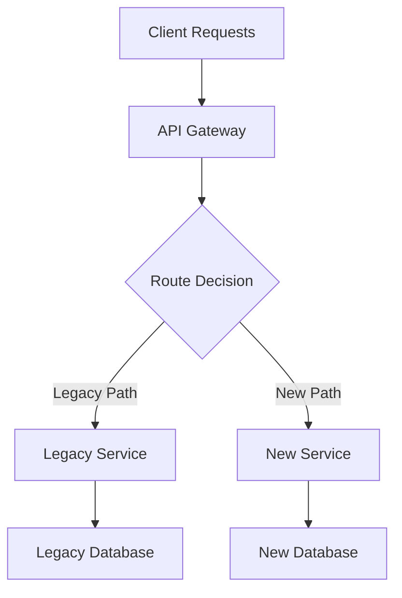

# Архитектор миграции { #migration-architect }

**Уровень:** МОЩНЫЙ  
**Категория:** Инженерно-миграционная стратегия  
**Цель:** Планирование миграции с нулевым временем простоя, проверка совместимости и выработка стратегии отката

## Обзор { #overview }

Скилл архитектора миграции предоставляет комплексные инструменты и методологии для планирования, выполнения и валидации сложных системных миграций с минимальным воздействием на бизнес. Этот скилл сочетает в себе проверенные модели миграции с автоматизированными инструментами планирования для обеспечения успешных переходов между системами, базами данных и инфраструктурой.

## Основные возможности { #core-capabilities }

### 1. Планирование миграционной стратегии { #1-migration-strategy-planning }
- **Поэтапное планирование миграции:** Разбейте сложные миграции на управляемые этапы с помощью четких гейтов проверки
- ** Оценка рисков:** Определение потенциальных точек сбоя и стратегий смягчения последствий перед выполнением
- ** Оценка временных рамок:** Создание реалистичных временных рамок на основе сложности миграции и ограниченности ресурсов
- ** Коммуникация с стейкхолдерами:** Создание коммуникационных шаблонов и дашбордов прогресса

### 2. Анализ совместимости { #2-compatibility-analysis }
- ** Эволюция схемы:** Анализ изменений схемы базы данных на предмет проблем с обратной совместимостью
- ** Управление версиями API:** Обнаружение критических изменений в REST/GraphQL API и интерфейсах микросервисов
- ** Проверка типа данных:** Выявление несоответствий форматов данных и требований к преобразованию
- **Анализ ограничений:** Проверка целостности ссылок и изменений бизнес-правил

### 3. Выработка стратегии отката { #3-rollback-strategy-generation }
- **Автоматизированные планы отката:** Создание комплексных процедур отката для каждого этапа миграции
- **Сценарии восстановления данных:** Создание процедур восстановления данных на определенный момент времени
- ** Откат сервиса:** Планируйте откаты версий сервиса с помощью управления трафиком
- **Контрольные точки проверки:** Определите критерии успеха и триггеры отката

## Быстрый запуск — планирование → проверка совместимости → создание отката { #quick-start--plan--check-compatibility--generate-rollback }

Все пути относительно этой папки скилла; примеры входных данных в `assets/`, ожидаемые формы в `expected_outputs/`.

```bash
# 1. Generate the migration plan from a spec (copy assets/sample_database_migration.json)
python3 scripts/migration_planner.py --input migration_spec.json --format json -o migration_plan.json

# 2. Check schema/API compatibility — exits non-zero unless fully compatible (CI gate)
python3 scripts/compatibility_checker.py --before assets/database_schema_before.json --after assets/database_schema_after.json --type database --format json -o compatibility.json

# 3. Generate the rollback runbook from the plan
python3 scripts/rollback_generator.py --input migration_plan.json --format both -o rollback_runbook
```

Цепочка выходных данных: `migration_plan.json` (`phases`, `risks`, `estimated_duration_hours`) подает шаг 3; `compatibility.json` отчеты `overall_compatibility` плюс `breaking_changes_count` / `potentially_breaking_count`.

**Гейт:** миграция не будет одобрена до тех пор, пока (a) `compatibility_checker` выходы 0 (`overall_compatibility: compatible`) или каждый нарушающий/потенциально нарушающий элемент явно принимается владельцем в письменной форме, и (б) для каждого этапа плана существует рансбук отката. Повторно запустите обе проверки после любой ревизии схемы.

## Модели миграции { #migration-patterns }

### Миграция баз данных { #database-migrations }

#### Паттерны эволюции схемы { #schema-evolution-patterns }
1. **Схема расширения контракта**
   - **Развернуть:** Добавить новые столбцы/таблицы рядом с существующей схемой
   - ** Двойная запись:** Приложение выполняет запись как в старую, так и в новую схему
   - **Миграция:** Повторное заполнение исторических данных в новую схему
   - **Контракт:** Удаление старых столбцов/таблиц после проверки

2. **Шаблон параллельной схемы**
   - Запустите новую схему параллельно с существующей схемой
   - Используйте фич-флаги для маршрутизации трафика между схемами
   - Проверка согласованности данных между параллельными системами
   - Сокращение, когда уверенность высока

3. **Миграция источников событий**
   - Фиксируйте все изменения как события во время окна миграции
   - Применяйте события к новой схеме для обеспечения согласованности
   - Включите возможность воспроизведения для сценариев отката

#### Стратегии переноса данных { #data-migration-strategies }
1. **Массовая миграция данных**
   - **Метод моментального снимка: ** Полное копирование данных во время периода обслуживания
   - ** Инкрементная синхронизация: ** Непрерывная синхронизация данных с отслеживанием изменений
   - **Потоковая обработка: ** Пайплайны преобразования данных в реальном времени

2. **Шаблон двойной записи**
   - Запись как в исходную, так и в целевую системы во время миграции
   - Внедрить шаблоны компенсации сбоев записи
   - Используйте распределенные транзакции там, где важна согласованность

3. **Сбор данных об изменениях (CDC)**
   - Передавать изменения базы данных в целевую систему
   - Поддерживайте конечную согласованность во время миграции
   - Включите миграцию с нулевым временем простоя для больших наборов данных

### Миграция служб { #service-migrations }

#### Рисунок душителя на фигуре { #strangler-fig-pattern }
1. **Перехват запросов:** Маршрутизация трафика через прокси/шлюз
2. **Постепенная замена:** Постепенное внедрение новых функциональных возможностей сервиса
3. ** Устаревший выход на пенсию:** Удаляйте старые компоненты сервиса, поскольку новые оказываются стабильными
4. ** Мониторинг:** Отслеживание производительности и частоты ошибок на протяжении всего перехода



#### Схема параллельного выполнения { #parallel-run-pattern }
1. ** Двойное выполнение:** Запускайте как старые, так и новые службы одновременно
2. **Теневой трафик:** Направляйте производственный трафик в обе системы
3. ** Сравнение результатов:** Сравните выходные данные для проверки правильности
4. ** Постепенное сокращение: ** Изменение процента трафика на основе достоверности

#### Схема развертывания канарейки { #canary-deployment-pattern }
1. **Ограниченная раскатка:** Деплей нового сервиса для небольшого процента пользователей
2. ** Мониторинг:** Отслеживание ключевых показателей (задержка, ошибки, ключевые показатели эффективности бизнеса)
3. ** Постепенное увеличение: ** Увеличивайте процент посещаемости по мере роста доверия
4. **Полная раскатка:** Завершите миграцию после прохождения проверки

### Миграция инфраструктуры { #infrastructure-migrations }

#### Миграция из облака в облако { #cloud-to-cloud-migration }
1. **Этап оценки**
   - Инвентаризация существующих ресурсов и зависимостей
   - Картографические сервисы для создания целевых облачных эквивалентов
   - Определите специфичные для поставщика функции, требующие рефакторинга

2. **Пилотная миграция**
   - Сначала перенесите некритичные рабочие нагрузки
   - Проверка моделей производительности и затрат
   - Усовершенствовать процедуры миграции

3. **Производственная миграция**
   - Используйте инфраструктуру в качестве кода для обеспечения согласованности
   - Внедрение межоблачных сетей во время перехода
   - Поддерживать возможности аварийного восстановления

#### Миграция из локальной системы в облачную { #on-premises-to-cloud-migration }
1. **Подъем и сдвиг**
   - Минимальные изменения в существующих приложениях
   - Быстрая миграция с последующей оптимизацией
   - Используйте инструменты и сервисы облачной миграции

2. **Перестройка архитектуры**
   - Перепроектируйте приложения для использования облачных шаблонов
   - Внедряйте микросервисы, контейнеры и бессерверные
   - Внедрять методы облачной безопасности и масштабирования

3. **Гибридный подход**
   - Храните конфиденциальные данные локально
   - Перенос вычислительных нагрузок в облако
   - Реализовать безопасное подключение между средами

## Фич-флаги для миграции { #feature-flags-for-migrations }

### Раскатка прогрессивной функции { #progressive-feature-rollout }
```python
# Example feature flag implementation
class MigrationFeatureFlag:
    def __init__(self, flag_name, rollout_percentage=0):
        self.flag_name = flag_name
        self.rollout_percentage = rollout_percentage
    
    def is_enabled_for_user(self, user_id):
        hash_value = hash(f"{self.flag_name}:{user_id}")
        return (hash_value % 100) < self.rollout_percentage
    
    def gradual_rollout(self, target_percentage, step_size=10):
        while self.rollout_percentage < target_percentage:
            self.rollout_percentage = min(
                self.rollout_percentage + step_size,
                target_percentage
            )
            yield self.rollout_percentage
```

### Схема автоматического выключателя { #circuit-breaker-pattern }
Внедрите автоматический возврат к устаревшим системам, когда новые системы демонстрируют снижение производительности:

```python
class MigrationCircuitBreaker:
    def __init__(self, failure_threshold=5, timeout=60):
        self.failure_count = 0
        self.failure_threshold = failure_threshold
        self.timeout = timeout
        self.last_failure_time = None
        self.state = 'CLOSED'  # CLOSED, OPEN, HALF_OPEN
    
    def call_new_service(self, request):
        if self.state == 'OPEN':
            if self.should_attempt_reset():
                self.state = 'HALF_OPEN'
            else:
                return self.fallback_to_legacy(request)
        
        try:
            response = self.new_service.process(request)
            self.on_success()
            return response
        except Exception as e:
            self.on_failure()
            return self.fallback_to_legacy(request)
```

## Проверка и сверка данных { #data-validation-and-reconciliation }

### Стратегии проверки { #validation-strategies }
1. **Проверка количества строк**
   - Сравните количество записей между источником и целью
   - Учетная запись для мягкого удаления и отфильтрованных записей
   - Реализовать оповещение на основе пороговых значений

2. **Контрольные суммы и хэширование**
   - Генерировать контрольные суммы для критических подмножеств данных
   - Сравните хэш-значения для обнаружения смещения данных
   - Используйте выборку для больших наборов данных

3. **Проверка бизнес-логики**
   - Выполняйте важные бизнес-запросы в обеих системах
   - Сравните совокупные результаты (суммы, подсчеты, средние значения)
   - Проверка полученных данных и вычислений

### Схемы согласования { #reconciliation-patterns }
1. **Дельта-обнаружение**
   ```sql
   -- Example delta query for reconciliation
   SELECT 'missing_in_target' as issue_type, source_id
   FROM source_table s
   WHERE NOT EXISTS (
       SELECT 1 FROM target_table t 
       WHERE t.id = s.id
   )
   UNION ALL
   SELECT 'extra_in_target' as issue_type, target_id
   FROM target_table t
   WHERE NOT EXISTS (
       SELECT 1 FROM source_table s 
       WHERE s.id = t.id
   );
   ```

2. **Автоматическая коррекция**
   - Внедрите сценарии восстановления данных для устранения распространенных проблем
   - Используйте идемпотентные операции для безопасного повторного выполнения
   - Регистрируйте все действия по исправлению для журналов аудита

## Стратегии отката { #rollback-strategies }

### Откат базы данных { #database-rollback }
1. **Откат схемы**
   - Поддерживать контроль версий схемы
   - По возможности используйте обратно совместимые миграции
   - Сохраняйте сценарии отката для каждого шага миграции

2. **Откат данных**
   - Оперативное восстановление с использованием резервных копий баз данных
   - Воспроизведение журнала транзакций для получения точных точек отката
   - Сохраняйте моментальные снимки данных на контрольных точках миграции

### Откат сервиса { #service-rollback }
1. **Сине-зеленое развертывание**
   - Сохраняйте предыдущую версию службы запущенной во время миграции
   - Переключите трафик обратно в синюю среду, если возникнут проблемы
   - Поддерживайте параллельную инфраструктуру во время окна миграции

2. **Скользящий откат**
   - Постепенно возвращайте трафик к предыдущей версии
   - Отслеживайте работоспособность системы во время процесса отката
   - Внедрить автоматические триггеры отката

### Откат инфраструктуры { #infrastructure-rollback }
1. **Инфраструктура как код**
   - Управление версиями всех определений инфраструктуры
   - Поддерживать шаблоны отката terraform/CloudFormation
   - Протестируйте процедуры отката в промежуточных средах

2. **Сохранение данных**
   - Сохраняйте данные в исходном расположении во время миграции
   - Реализовать обратную синхронизацию данных с исходными системами
   - Поддерживайте стратегии резервного копирования в обеих средах

## Фреймворк для оценки рисков { #risk-assessment-framework }

### Категории риска { #risk-categories }
1. **Технические риски**
   - Потеря или повреждение данных
   - Простои в обслуживании или снижение производительности
   - Сбои интеграции с зависимыми системами
   - Проблемы с масштабируемостью при производственной нагрузке

2. **Бизнес-риски**
   - Влияние перебоев в обслуживании на доходы
   - Ухудшение качества обслуживания клиентов
   - Соблюдение требований и проблемы регулирования
   - Влияние на репутацию бренда

3. **Операционные риски**
   - Пробелы в знаниях команды
   - Недостаточный охват тестированием
   - Неадекватный мониторинг и оповещение
   - Сбои в работе связи

### Стратегии снижения рисков { #risk-mitigation-strategies }
1. **Технические меры по смягчению последствий**
   - Комплексное тестирование (модуль, интеграция, нагрузка, хаос)
   - Постепенная раскатка с автоматическими триггерами отката
   - Процессы проверки и сверки данных
   - Мониторинг производительности и оповещение

2. **Меры по смягчению последствий для бизнеса**
   - Планы коммуникации с стейкхолдерами
   - Процедуры обеспечения непрерывности бизнеса
   - Стратегии уведомления клиентов
   - Меры по защите доходов

3. **Оперативные меры по смягчению последствий**
   - Обучение команды и документация
   - Создание и тестирование рансбука
   - Планирование ротации по вызову
   - Процессы ревью после миграции

## Миграционные рансбуки { #migration-runbooks }

### Чек-лист для подготовки к миграцииMigrationMigration { #pre-migration-checklist }
- [ ] План миграции ревью и утвержден
- [ ] Процедуры отката протестированы и утверждены
- [ ] Настроен мониторинг и оповещение
- [ ] Определены роли и обязанности команды
- [ ] Активирован план коммуникации с стейкхолдерами
- [ ] Проверены процедуры резервного копирования и восстановления
- [ ] Проверка тестовой среды завершена
- [ ] Установлены контрольные показатели эффективности
- [ ] Ревью системы безопасности завершен
- [ ] Подтверждено соответствие требованиям

### Во время миграции { #during-migration }
- [ ] Выполнять этапы миграции в запланированном порядке
- [ ] Постоянно отслеживать ключевые показатели эффективности
- [ ] Проверка согласованности данных на каждой контрольной точке
- [ ] Информировать о достигнутом прогрессе стейкхолдеры
- [ ] Документируйте любые отклонения от плана
- [ ] Выполнить откат, если критерии успеха не выполнены
- [ ] Координация с зависимыми командами
- [ ] Вести подробные журналы выполнения

### Постмиграционный период { #post-migration }
- [ ] Подтвердите выполнение всех критериев успеха
- [ ] Выполнить комплексную проверку работоспособности системы
- [ ] Выполнить процедуры сверки данных
- [ ] Контролируйте производительность системы в течение 72 часов
- [ ] Обновите документацию и рансбуки
- [ ] Вывод из эксплуатации устаревших систем (если применимо)
- [ ] Провести ретроспективу после миграции
- [ ] Артефакты переноса архива
- [ ] Обновить процедуры аварийного восстановления

## Инструменты и технологии { #tools-and-technologies }

### Инструменты планирования миграции { #migration-planning-tools }
- **migration_planner.py :** Автоматическое формирование плана миграции
- **compatibility_checker.py :** Анализ совместимости схемы и API
- **rollback_generator.py :** Генерация комплексной процедуры отката

### Инструменты проверки { #validation-tools }
- Утилиты сравнения баз данных (схема и данные)
- Фреймворки для тестирования контрактов API
- Инструменты для сравнительного анализа производительности
- Пайплайны проверки качества данных

### Мониторинг и оповещение { #monitoring-and-alerting }
- Дашборд прогресса миграции в режиме реального времени
- Автоматизированные системы триггеров отката
- Мониторинг бизнес-показателей
- Системы уведомления стейкхолдеров

## Лучшие практики { #best-practices }

### Этап планирования { #planning-phase }
1. **Начните с оценки рисков:** Определите все возможные способы отказа перед планированием
2. **Дизайн для отката:** На каждом этапе миграции должна быть протестирована процедура отката
3. ** Проверка на промежуточном этапе:** Выполнить полный процесс миграции в среде, подобной производственной
4. **Запланируйте постепенное раскатку:** Используйте фич-флаги и маршрутизацию трафика для контролируемой миграции

### Фаза выполнения { #execution-phase }
1. ** Постоянный мониторинг:** Отслеживание как технических, так и бизнес-показателей на протяжении всего процесса
2. ** Активно общайтесь:** Информируйте все стейкхолдеры о прогрессе и проблемах
3. **Документируйте все:** Ведите подробные журналы для анализа после миграции
4. ** Оставайтесь гибкими:** Будьте готовы корректировать временные рамки в зависимости от реальных показателей

### Этап проверки { #validation-phase }
1. **Автоматизировать проверку:** Использовать автоматизированные инструменты для проверки согласованности данных и производительности
2. **Тестирование бизнес-логики:** Сквозная проверка критически важных бизнес-процессов
3. **Нагрузочное тестирование:** Проверка производительности системы при ожидаемой производственной нагрузке
4. ** Проверка безопасности:** Убедитесь, что средства контроля безопасности функционируют должным образом в новой среде

## Интеграция с жизненным циклом разработки { #integration-with-development-lifecycle }

### Интеграция CI/CD { #cicd-integration }
```yaml
# Example migration pipeline stage
migration_validation:
  stage: test
  script:
    - python scripts/compatibility_checker.py --before=old_schema.json --after=new_schema.json
    - python scripts/migration_planner.py --config=migration_config.json --validate
  artifacts:
    reports:
      - compatibility_report.json
      - migration_plan.json
```

### Инфраструктура как код { #infrastructure-as-code }
```terraform
# Example Terraform for blue-green infrastructure
resource "aws_instance" "blue_environment" {
  count = var.migration_phase == "preparation" ? var.instance_count : 0
  # Blue environment configuration
}

resource "aws_instance" "green_environment" {
  count = var.migration_phase == "execution" ? var.instance_count : 0
  # Green environment configuration
}
```

Этот скилл архитектора миграции обеспечивает комплексный фреймворк для планирования, выполнения и проверки правильности миграции сложных систем при минимизации влияния на бизнес и технических рисков. Сочетание автоматизированных инструментов, проверенных шаблонов и подробных процедур позволяет организациям уверенно выполнять даже самые сложные проекты миграции.